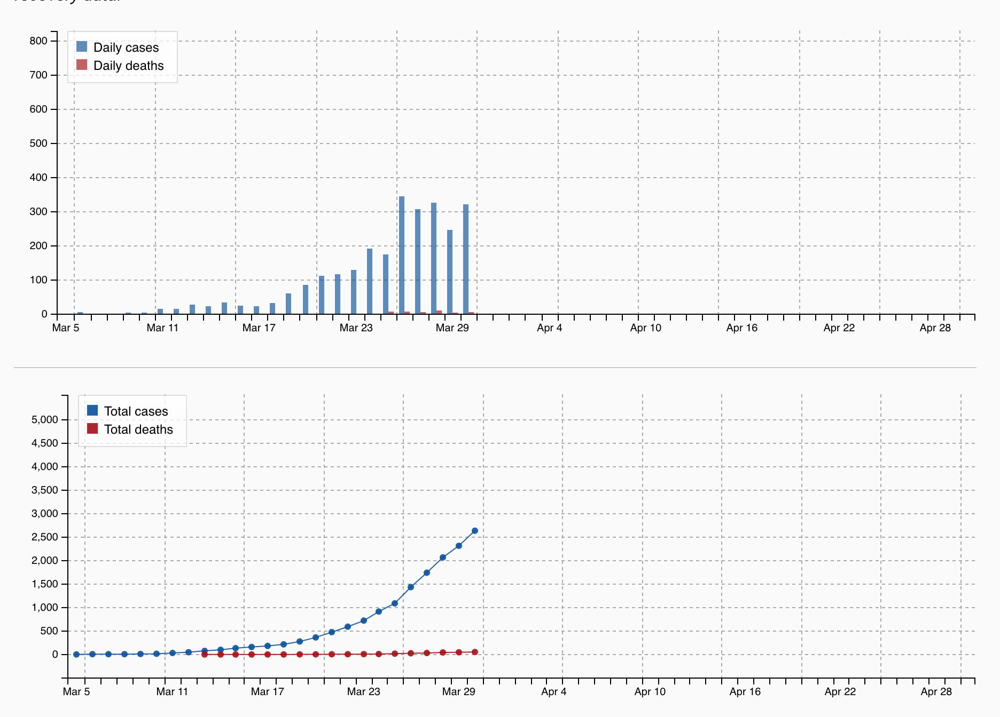

# Data and plots on new daily cases of COVID-19 in Colorado  

The data here were read and entered (by hand) from 
[https://www.denverpost.com/2020/03/06/coronavirus-map-colorado/](https://www.denverpost.com/2020/03/06/coronavirus-map-colorado/), 
accessed periodically throughout March of 2020.

Data like these could be used to partially reconstruct a plot like the one shown below, which is a screenshot taken from the webpage above on March 21, 2020.

Starting around March 30th, the data were displayed in two separate plots as follows:

## Question:
How could we use the data here to reproduce the plots shown?
