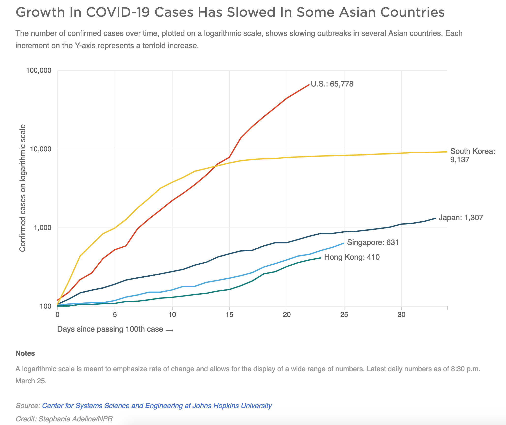

# An Example Plot Showing Growth of COVID-19 cases over time in several countries

## Information about the plot
The image below is a screenshot from an NPR news story accessed at 
[https://www.npr.org/sections/goatsandsoda/2020/03/26/821688981/how-south-korea-reigned-in-the-outbreak-without-shutting-everything-down](https://www.npr.org/sections/goatsandsoda/2020/03/26/821688981/how-south-korea-reigned-in-the-outbreak-without-shutting-everything-down)
on 3/26/20

The caption under the plot reads:
> Notes

> A logarithmic scale is meant to emphasize rate of change and allows for the display of a wide range of numbers. Latest daily numbers as of 8:30 p.m. March 25.

> Source: Center for Systems Science and Engineering at Johns Hopkins University

> Credit: Stephanie Adeline/NPR

## Question:
How might we write code to reproduce a plot like this?
