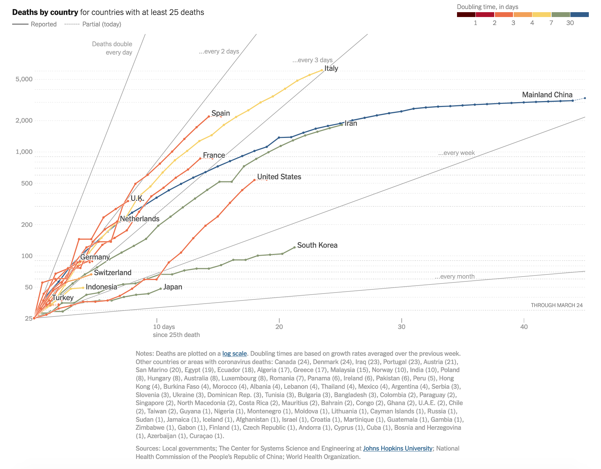
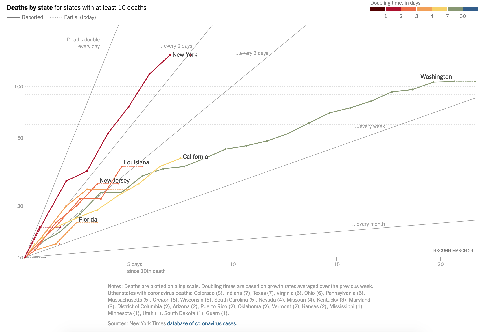

# Deaths and Death Rates from COVID-19 

This directory has two example plots from the New York Times.  These images were taken as screeshots on March 24, 2020, around 11:55 a.m. from  [https://www.nytimes.com/interactive/2020/03/21/upshot/coronavirus-deaths-by-country.html](https://www.nytimes.com/interactive/2020/03/21/upshot/coronavirus-deaths-by-country.html)

The captions in the images explain the data used.

## Question:
What would be required if we wanted to produce plots like these?

## Access to Raw Data:
The Times has made its data public on GitHub!  You can find them at [https://github.com/nytimes/covid-19-data](https://github.com/nytimes/covid-19-data)
