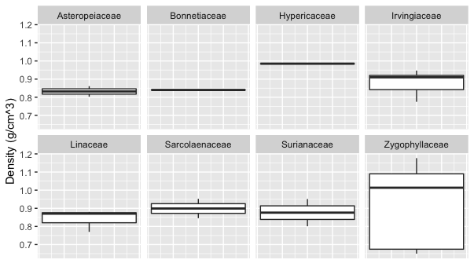
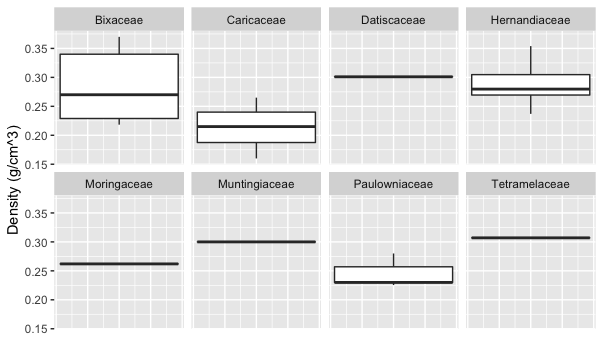
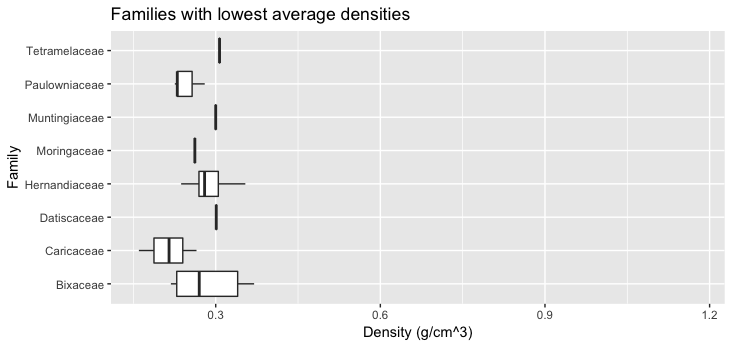

# Lab for Week 11

## More data filtering, subsetting, summarizing, and plotting

### Goals for this lab
1. Creatively solve problems involving summarizing data that have real-world features like missing values, pseudoreplication, and nested structure.
2. Practice using `ggplot`
3. Consider ways to "build your own" solutions from base R functions compared to one-liners from `dplyr`.  Think about ways to "know" that you are getting the results you intend to get, and ways to validate that.

### Background:
This week we'll be working with the data published as: "Data from: Towards a worldwide wood economics spectrum".  Full citation:
> Zanne AE, Lopez-Gonzalez G, Coomes DA, Ilic J, Jansen S, Lewis SL, Miller RB, Swenson NG, Wiemann MC, Chave J (2009) Data from: Towards a worldwide wood economics spectrum. Dryad Digital Repository. [https://doi.org/10.5061/dryad.234][datalink]

These data were archived at Dryad in association with the following publication:
> Chave J, Coomes DA, Jansen S, Lewis SL, Swenson NG, Zanne AE (2009) Towards a worldwide wood economics spectrum. Ecology Letters 12(4): 351-366. https://doi.org/10.1111/j.1461-0248.2009.01285.x

The general biological question we will be asking of these data is: *How does wood density vary across families of tree species?*


### Instructions for Lab:

#### Part I: Getting set up to work with the data

##### Pre-requisites for the lab
If you have not already done so, install the tidyverse in RStudio:
```
install.packages("tidyverse")
```
This may take  few minutes ...

##### 1. Download the [data from DataDryad][datalink] 


##### 2. Take a look a the data and turn it into a .csv
Note that the data are formatted as an Excel Spreadsheet.  Open the spreadsheet in Excel and take a look around.  Note that there are multiple "tabs."  Please read the metadata in the first tab ("Database use policy").  Then:
+ Click on the tab named "Data"
+ Check out the data here and make sure you understand it.  Ask questions if you aren't sure what it represents.
+ Use "Save as ..." to save this tab as a .csv file.  Make sure to save it with a sensible name and to a directory to which you know how to navigate.

##### 3. Start an R script for this lab
+ Use `read.csv()` to import the data into RStudio
+ I suggest using the `stringsAsFactors = F` option with `read.csv()`
+ Note: the column with density data will import with a really long name.  Feel free to rename it if you want to for convenience.  See [this post](https://stackoverflow.com/questions/7531868/how-to-rename-a-single-column-in-a-data-frame) on StackOverflow if you need a reference.
+ Do all subsequent work (below) in the script you have started

#### Part II: Working with density data

##### 4. Removing rows with missing data
It turns out there is one entry (out of 16468) in the data for which there is no density entered.  It will import as `NA`.
+ 4a. Which row is it?
+ 4b. Remove that row from the data frame (there are [several ways](https://stackoverflow.com/questions/12328056/how-do-i-delete-rows-in-a-data-frame) to do this)

##### 5. Dealing with one kind of pseudo-replication
The species' scientific names are given in the variable (column) in the data frame named `Binomial`. Some of the species in this database appear multiple times.  For certain kinds of analyses, it might be advantageous to collapse each species into a single point.  One way to do this could be to find the mean (average) of each species' density measurements. Starting with your result from problem 4b, create a new data frame that:
+ has each species listed only once,  
+ has the `Family` and `Binomial` information for each species, and  
+ has the mean of the `Density` measurements for each species

*Hints*: There are multiple ways to do this.  
+ With base R, you could do it with a combination of `unique()`, conditionals, and a loop.  
+ With the package `dplyr` (included in the tidyverse), you could explore how to use `summarise()` in conjunction with `group_by()`, perhaps. <br> (Remember that you have to `library("dplyr")` to use its functions.)  

Regardless of your approach, imagine what you want before you start.  What should the data frame that you will produce look like?  Also, what kind of web search might you do to solve this if you aren't sure how?

*Hint*: Here's one way the first few rows of it might look:

| Binomial | Family | Density |
| :--------- | :------- | :-------- |
| Abarema jupunba | Fabaceae | 0.585 |
| Abarema macradenia | Fabaceae | 0.438 |
| Abies alba | Pinaceae | 0.353 |

*Hint*: Your result should have a number of rows equal to the number of species, which is 8412.

**BONUS for problem 5**:  Solve this problem in two different ways and validate that your two solutions produce exactly the same result.

##### 6. Contrasting most and least dense families
The goal of this problem is to figure out which families of trees have the greatest and least densities.  Here is a suggested set of steps, starting with the data frame you produced at the end of problem 5:
+ 6a. Make a new data frame that has the average density for each *Family* (and no longer has individual species).  It might look like this:

| Family | MeanDensity |
| :------- | :-------- |
| Acanthaceae | 0.656 |  
| Achariaceae | 0.610 | 
| Actinidiaceae | 0.411 |

*Hints*:  
+ Your result should have a number of rows equal to the number of families in the data set, which is 191  
+ You should be able to co-opt your procedure from problem 5 for this problem. 

+ 6b. Sort the result of problem 6a by MeanDensity (and store the sorted result in a data frame).  *Hints*:  
    + using only base R, you could try the `order()` function
    + using `dplyr`, you could try the `arrange()` function
    
+ 6c.  Using your results from problem 6b: 
    + What are the 8 families with the highest average densities?  
    + What are the 8 families with the lowest average densities?

#### Part III.  Plotting

For these problems, you will need to `library("ggplot2")`

##### 7.  Plotting densities of most and least dense families with facets
The goal of this part is to make two figures using `ggplot` combined with the results of multiple previous problems.  Here are two plots we want to produce:

Densities of individual species from the families with the highest average densities:  


Densities of individual species from the families with the lowest average densities:  


To think about writing code that accomplishes this, consider the individual data points and how they are organized:
+ Each individual point comes from one species (not a family mean), so you want to plot some of the data obtained from problem 5
+ You need to plot a subset of the data, corresponding to the species from the families with the highest or lowest densities, which is information you gained from problem 6.
+ Hint for subsetting: if you have a vector of family names that you want to use as the criteria for subsetting, the `%in%` operator can be very helpful (check out [line 108 of Sam's code for some of the Cusack et al. dataset problems](https://github.com/flaxmans/CompBio_on_git/blob/a6fbde60316c0d986fa1ec24b23402d480097855/Datasets/Cusack_et_al/FilteringAndPlottingExamples.R#L108) for an example).


##### 8.  Facilitating comparisons with graphics.
The plots from the last problem aren't the easiest to compare.  In this case we might instead prefer something like the following:





Try to figure out the syntax in `ggplot` to plot the same data but instead in this format.  *Hint*: you no longer need `facet_wrap()`, but you will need `coord_flip()`.


[datalink]: https://doi.org/10.5061/dryad.234
