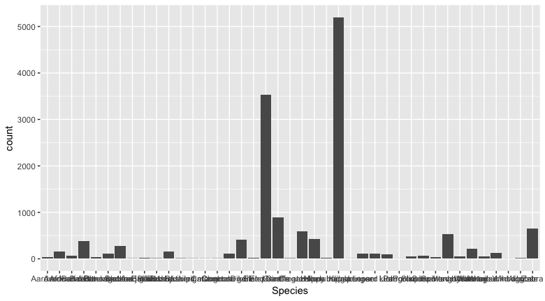
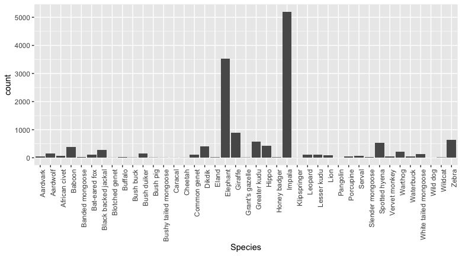
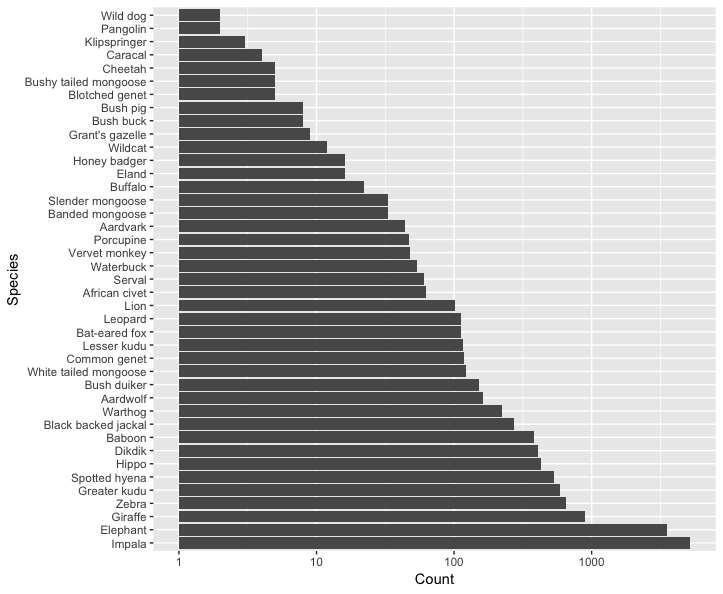

# Lab 12

## Choose your own adventure!

### Introduction

Lab 11 was a combination of items from many weeks of the course, reviewing some of the old and trying some newer items.  For some questions, the "old" may have come back easily.  For other questions, it may have been a bit of "How did we do that again?"  This is all natural and part of the process for everyone.

If you finished Lab 11's problems, then please work on the problems below for this week.  If you did NOT finish Lab 11's problems, then you have a choice: continue to [work on Lab 11](https://github.com/flaxmans/CompBio_on_git/blob/master/Labs/Lab11/Lab11_WoodDatabase.md), or do the problems below.  Like last week, I want you to spend 2 hours working on whatever you choose.  If you finish one, then move to the other.

If you have questions about Assignment 8, now is a good time to ask Sam as well.  Remember: it is due on Monday!

### Lab 12 new problems: Some more `ggplot()` 

Each of the following problems below will require you to be resourceful in terms of finding functions/commands that do what you want to do, and figuring out how to use them.  

#### Problem 1: A bar plot in `ggplot()`

Write code using `ggplot()` that makes the following plot based upon the [Cusack et al. data](https://github.com/flaxmans/CompBio_on_git/blob/master/Datasets/Cusack_et_al/Cusack_et_al_random_versus_trail_camera_trap_data_Ruaha_2013_14.csv), which you likely already downloaded for lab 09.

As you look at this plot, the first thing that may be obvious is that you can't read the species' names, which are shown on the x axis.  All the species' names (all 41 of them) are indeed there on the x-axis, and the y-axis is the total number of observations of each species in the whole dataset.  

#### Problem 2: Rotate the axis tick labels.  

The species' names in the plot above are shown as what are called "x-axis tick labels".  Add to your code from Problem 1 to make the plot as shown next, with  x-axis tick labels that are readable because they are running 90 degrees to the horizontal:

#### Problem 3: A different orientation, scaling, and sorting

Suppose you decided that you'd like to flip the axes, sort the species from least to most abundant in the plot, and also transform the count axis to be logarithmic so that you can see the smaller count values more easily.  In other words, figure out how to make the following plot:

### Finishing lab: 
Please push whatever you have done at the end of two hours to GitHub.

