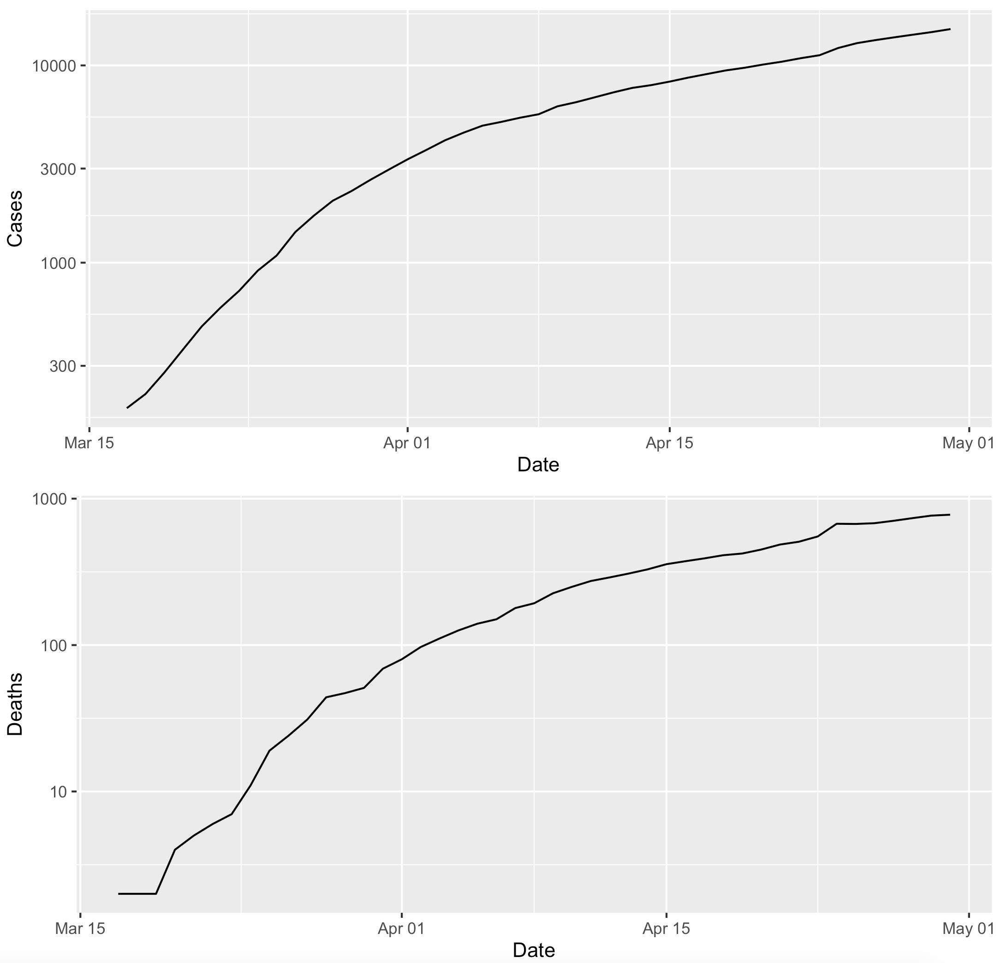

# Lab 12 -- New for 2021

## Adding concepts, models, and reference lines to plots

<hr>

### Introduction

This week in class  we walked into a new dataset, beginning with a script that I emailed to you and that is also available [here on GitHub](https://github.com/flaxmans/CompBio_on_git/blob/main/ExampleScripts/In-Class_33_More_Data_Wrangling.R).

Starting with the raw data imported by that script, I hope we can write code that will make "doubling time" plots for Cases and Deaths for statewide Colorado Data on COVID-19.  These plots would be very similar to [ones that appeared on the New York Times website](https://github.com/flaxmans/CompBio_on_git/tree/main/Datasets/COVID-19/NYTimes_DoublingTimesDeaths) early on during the pandemic.

 The goal of this lab is to give you time to work toward 

### Lab 12 problems:

#### Part 1: (Finish) Getting the data into shape

We started discussing in class how to perform various operations on the data to create a nice clean data set for plotting purposes.  The tasks for this were detailed as comments in the script linked above.  Here they are for reference:
```
# try to figure out ways to do all of the following using functions from the Tidyverse

# 1. subset the data so that we only keep the rows where the text in the column (variable) named "Name" is "Colorado"

# 2. subset to keep (select) only the columns "Date", "Cases", and "Deaths"

# 3. change the data in the "Date" column to be actual dates rather than a character

# 4. sort the data so that the rows are in order by date from earliest to latest

# 5. subset the data so that we only have dates prior to May 15th, 2020
```
If we didn't already do so, work on getting all five of those steps into a single pipeline (in R) that will lead to the creation of a data frame/tibble that might look like this:
| Date | Cases | Deaths |
|:------------|:----------:|:----------:|
| 2020-03-17 | 183 | 2 |
| 2020-03-18 | 216 | 2 |
| 2020-03-19 | 277 | 2 |
| 2020-03-20 | 363 | 4 |
| ... | ... | ... |


#### Part 2:  Make plots in R using the data from Part 1
Try to create the following two plots (two separate plots):



#### Part 3: Write a function for adding doubling times


### Finishing lab: 
Please push whatever you have done at the end of two hours to GitHub.


