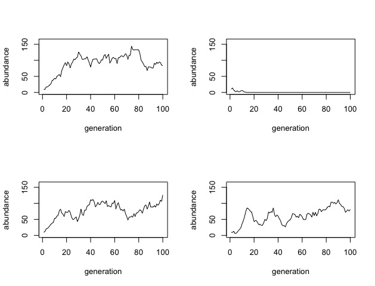

# Lab for week 12 

### More fun with stochastic problems and probability

#### Goals for this week:

1. practice working with stochastic models
2. compute exact probabilities for mathematically simple situations
3. compute approximate probabilities for more complex situations using results of simulations
4. manage replicates of data in a way that facilitates analysis

#### Exercises
 
##### Forecasting populations 

Recall the equation we used previously for the discrete-time logistic growth model of population dynamics:

	n[t+1] = n[t] + r * n[t] * (k - n[t])/k , 
	
where `r` is the intrinsic growth rate, `k` is the carrying capacity, and `n[t]` is the abundance of the population at time step `t`.  This equation is a purely deterministic model, but we can use it as the basis for building a stochastic model.  Specifically, assuming that reproduction and death events are stochastic and independent of one another, the change in population size from one generation to the next can be modeled as a Poisson process.  For a given population size, `n[t]`, the equation above gives the **expected value** of the population in the next time step, i.e., it gives the "lambda" parameter of the Poisson distribution.  Note that this expected value (i.e., lambda) changes as `n` changes.

###### 1. Write a function that simulates this stochastic model of population dynamics. 
Your function should take three arguments: (i) r, (ii) k, (iii) the total number of generations to simulate, and (iv) the initial value of abundance.  As default values of these parameters, I suggest using `r = 0.1, k = 100, gens = 100, n_init = 10`.

###### 2. Make a plot of the resuls that your function returns with the defaults suggested above.  
It might look something like one of these plots:

###### 3. Assuming `n[1] = 10`, using the default parameters given above, do the following:  
(i) Calculate the probability that the population size does not change from n[1] to n[2].   
(ii) Calculate the probability that the population shrinks from n[1] to n[2].  
(iii) Calculate the probability that the population increases from n[1] to n[2].  
_Hint: your calculations from steps (i) - (iii) should sum to 1_  
(iv) Calculate the probability that n[2] is between 15 and 25 (inclusive of those numbers)  
(v) Calculate the probabilty that the population goes extinct at generation 2.  

###### 4. Verbally, using just your intuition, what is your expectation about the long run average (expected value) of `n` in this model?

###### 5. Write a new function that runs replicates of your model.  
This function should call the function you wrote for A1 and store the returned data in an object that stores multiple replicates (e.g., a matrix or data frame).  

###### 6. Use the function you wrote in A5 to generate 1000 replicates of the model as run with the default parameters.

###### 7. Use the replicates from A6 to do the following:  
(i) Calculate and plot the mean abundance over time (i.e., mean value of abundance at each time step).  How does it compare to your expectation from A4?  Comment on the similarity or deviation from your intuitive expectation.  
(ii) Based upon your numerical results, estimate the probability that a population characterized by the default parameters would go extinct within 25 generations.  
(iii) Based upon your numerical results, estimate the probability that a population would have an abundance of half of its carrying capacity or more at the end of 100 generations.  
(iv) Using your numerical results, estimate the 95% confidence interval for the population at each time step. Note that this means finding the 2.5% and 97.5% quantiles.  Hint: check out the `quantile()` function.  
(v) Overlay lines representing those quantiles on the plot from part (i) of this problem.  

